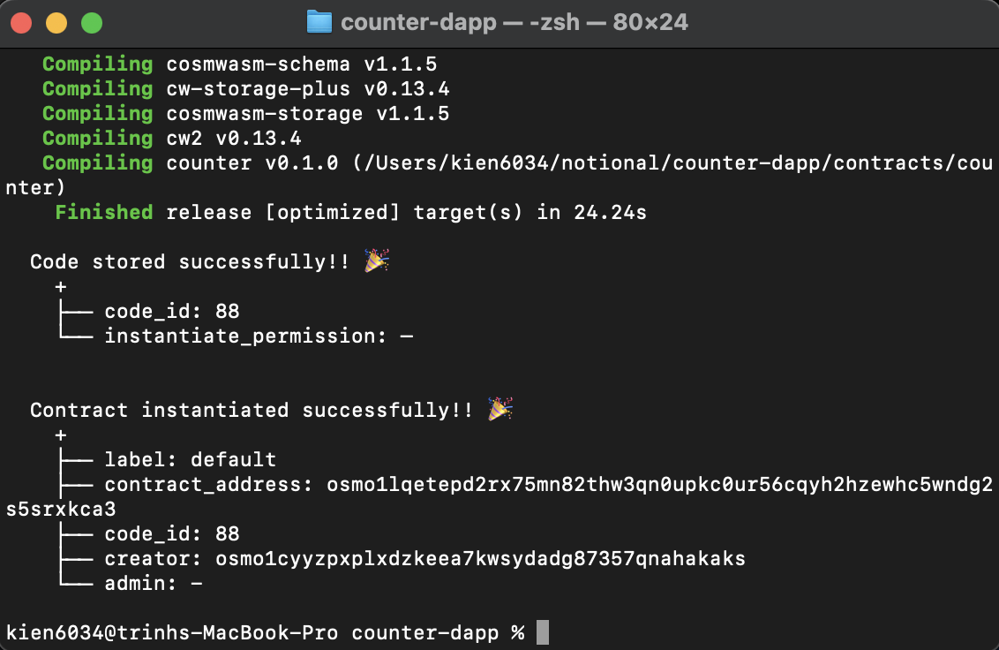
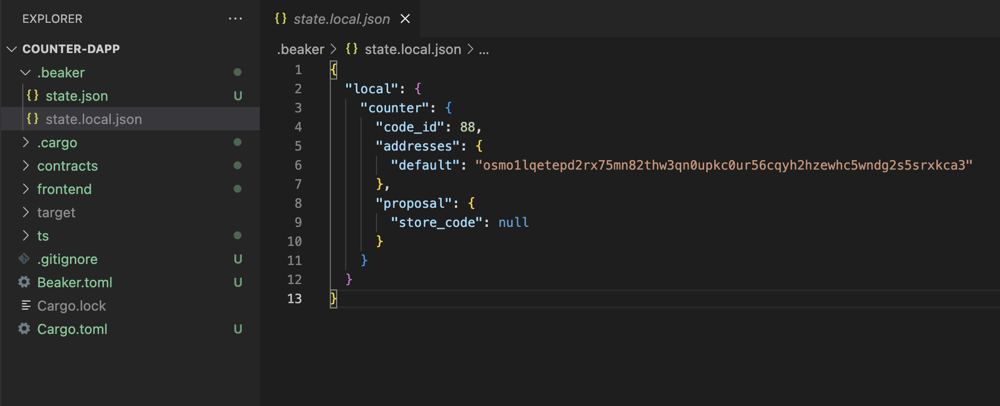
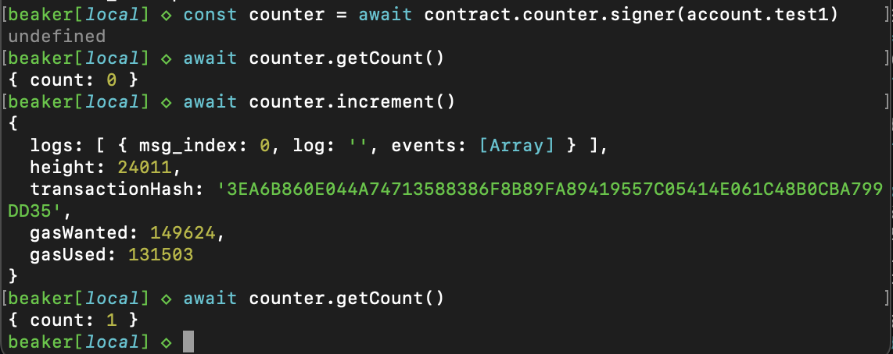

# Docs for using Beaker 

## Installation 
### Requirements 
- Rust: https://www.rust-lang.org/tools/install
- Cargo: https://doc.rust-lang.org/cargo/getting-started/installation.html

You need to install Rust and Cargo first in order to continue the following steps 

### Install Local Osmosis 
**_NOTE:_** Referrence: https://docs.osmosis.zone/cosmwasm/local/localosmosis

You can either implement the Osmosis tool kit using the automatic setup provided by Osmosis:
```
bash <(curl -sL https://get.osmosis.zone/run)
``` 

Or you can download the LocalOsmosis from the Github repo and speed up Blocktime for faster testing experience
```
https://github.com/osmosis-labs/LocalOsmosis
``` 

**_NOTE:_** I suggest you should try using automatic setup providede by Osmosis first. By doing this, we have full tool kits provided by Osmosis, including Local Osmosis, osmosisd CLI. And it even downloads all the prerequisites for you i suppposed 


## Beaker

**_NOTE:_** Referrence:  https://docs.osmosis.zone/beaker/#execute-contract-messages

### Install 
To install beaker
```
cargo install -f beaker # `-f` flag for up-to-date version
```

### Setup 
- Create new workspace: 
```
beaker new counter-dapp
``` 
A command line prompt will show up and ask you to choose between mininal or counter-example template. If you choose the `minimal`, an empty work space structure will be provided and you need to add the contract in the following steps. If you choose the `couter-example`, an workspace with a counter-example contract + frontend will be generated. You can directly test beaker with this prebuild smartcontract


Workspace structure will look like this
```
.
├── frontend
├── contracts
├── Cargo.toml
├── Beaker.toml
├── .gitignore
└── .beaker
```

The contracts will be located in the contracts folder. If you choose the minimal template, or if you want to add new contracts to the current workspace, you can perform the following.

1. Go to Beaker.toml file and edit the template_repo. If not edited, the default template repo will be set to https://github.com/osmosis-labs/cw-tpl-osmosis.git.

For example, we can create our own smart contract template repo, and replace that inside the Beaker.toml 
```
# Beaker.toml

[wasm]
template_repo = "https://github.com/kien6034/Cosmwasm-Counter"
```
**_NOTE:_**: The default branch of the repo has to be set under the name "main", not "master"

2. Add new contract to the workspace 
```
beaker wasm new contract_name
``` 


### Deployment 
Let's running with the `counter-example` template for consistency. 

**_NOTE:_** To deploy and test on `LocalOsmosis`, please make sure you have an instance of `LocalOsmosis` running. 
Follow this docs, enable `Dockers` and run `LocalOsmosis`


To deploy contract on LocalOsmosis
<br>
Referrence: https://docs.osmosis.zone/beaker/#deploy-contract-on-localosmosis
```
beaker wasm deploy counter --signer-account test1 --no-wasm-opt --raw '{ "count": 0 }'
``` 

This CLI actions will perfrom 3 things. It `build` the contracts, `upload` the codeid and `instantiate` the contract. 

This is what we get after the deployment 


Deployment data will be stored on the .beaker folder. We've just deployed on the `LocalOsmosis`, so the data is stored on `state.local.json`. The `testnet.local.json` and `mainnet.local.json`  will be used to store data if you deploy on `testnet` and `mainnet`




### Execute Contract Messages 
- Execute 
```
beaker wasm execute counter --raw '{ "increment": {} }' --signer-account test1
```

- Query     
```
beaker wasm query counter --raw '{"get_count": {}}'
```
This should errors free, so you can just test and try it. 


### Beaker Console 

**_NOTE:_** Referrence: https://docs.osmosis.zone/beaker/#console

Run `beaker console`, a prompt will pop up and ask you to generate Typescript of the project, press y to generate. 

A console will show up, and now you can interact with the deployed contract. In this example, I interact with the `counter` contract i've just deployed on `LocalOsmosis`


**_NOTE:_** You might get some issues with current version of `beaker`, something like `CounterContractContract` not found. You might need to fix the source code of the `beaker` themself. Please DM me if you get the issue and cannot resolve it
